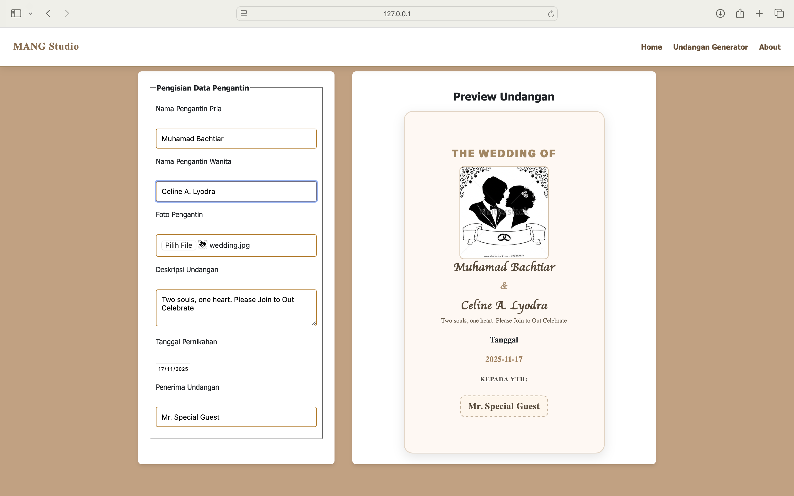

## 💍 Wedding Invitation Live Preview Generator

### Ujian Tengah Semester — Desain Web

**Nama:** *Muhamad Bachtiar* <br>
**NIM:** *4524210141* <br>
**Mata Kuliah:** Desain Web - A <br>
**Topik:** **Wedding Invitation Live Preview Generator**

---

### 📌 Deskripsi Proyek

*Source Code ini dibuat ubtuk memenuhi Ujian Tengah Semester - Desain Web A*
Source Code Aplikasi web Undangan Pernikahan Generator **Berbasis HTML, CSS dan JavaScript**.
Aplikasi web ini memungkinkan pengguna mengisi data undangan pernikahan pada **Panel Kontrol**, dan hasil undangan akan muncul pada **Area Pratinjau**.

---

### 🎯 Fitur Utama

* Form input data pengantin dan penerima undangan
* Upload foto pengantin
* Live preview langsung tanpa refresh
* Layout responsif (mobile → desktop grid)
* Desain elegan tema wedding
* Validasi struktur HTML semantik
* Styling menggunakan CSS modern (grid + clamp + rem)

---

### 🛠️ Teknologi yang Digunakan

| Bagian     | Teknologi                        |
| ---------- | -------------------------------- |
| Markup     | HTML5 Semantik                   |
| Styling    | CSS3, Grid, Media Query          |
| Interaksi  | JavaScript (DOM, Event Listener) |
| Deployment | GitHub Repository                |

---

### 📁 Struktur Folder

```
📦 uts-dw-muhamad_bachtiar-4524210141
├── index.html
├── style.css
├── script.js
└── README.md
```

---

### ⚙️ Cara Menjalankan

1. Clone project dari GitHub
2. Buka `index.html` di browser
3. Masukkan data di form → preview berubah otomatis

---

### 📸 Preview Fitur

---



---

### ✅ Checklist Penilaian UTS

### ✅ Checklist Penilaian UTS

| Kriteria                                             | Status |
| ---------------------------------------------------- | ------ |
| Repositori GitHub sudah dibuat                       | [x]    |
| Melakukan minimal 3 commit                           | [x]    |
| Menerapkan HTML Semantik (header, main, footer)      | [x]    |
| Formulir sudah aksesibel (label + for/id)            | [x]    |
| Layout Mobile-First (1 kolom)                        | [x]    |
| Layout Desktop (2 kolom) pakai Grid                  | [x]    |
| Menerapkan JavaScript Live Preview (minimal 3 input) | [x]    |

---

### 📜 Lisensi

Proyek ini dibuat untuk keperluan akademik UTS Desain Web.
Silakan digunakan sebagai referensi belajar, tidak untuk plagiarisme.

---

### 🙏 Ucapan Terima Kasih

Terima kasih kepada [Bapak Adi (Dosen Pengampu)](https://github.com/adiwp)
Semoga web ini bermanfaat dan memenuhi tugas UTS sesuai dengan Kriteria ✨
